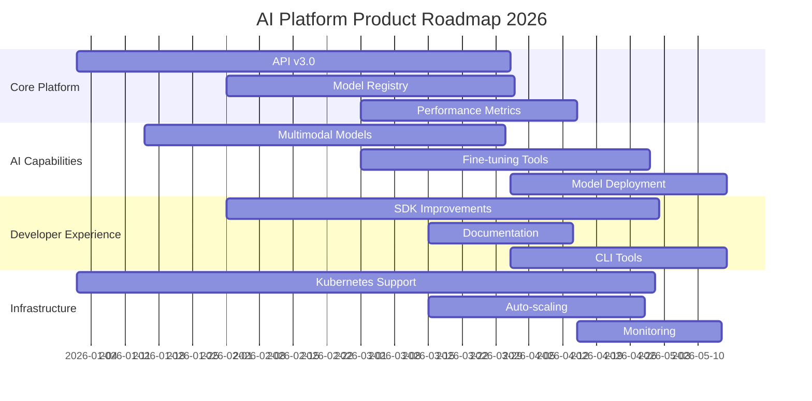
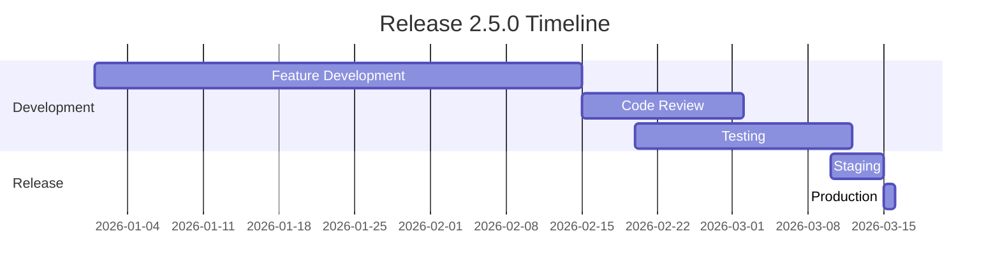

# AI Platform Roadmap Planning Templates

## Overview

This document provides comprehensive templates and guidelines for creating and maintaining AI Platform roadmaps. These templates help ensure consistent planning, clear communication, and effective execution of platform development initiatives.

## 1. Strategic Roadmap Template

### Executive Summary
**Vision Statement**: 
[Concise statement of the platform's long-term vision]

**Mission Statement**: 
[Description of the platform's purpose and primary objectives]

**Strategic Pillars**:
1. [Primary strategic focus area]
2. [Secondary strategic focus area]
3. [Tertiary strategic focus area]

### Strategic Initiatives
| Initiative | Description | Strategic Alignment | Timeline | Resources | Success Metrics |
|-----------|-------------|-------------------|----------|-----------|----------------|
| [Initiative 1] | [Brief description] | [Strategic pillar] | [Q1 2026] | [Team/ budget] | [KPIs] |
| [Initiative 2] | [Brief description] | [Strategic pillar] | [Q2 2026] | [Team/ budget] | [KPIs] |

### Market Analysis
**Target Markets**:
- [Primary market segment]
- [Secondary market segment]
- [Emerging market opportunity]

**Competitive Landscape**:
- [Key competitor 1]: [Strengths/weaknesses]
- [Key competitor 2]: [Strengths/weaknesses]
- [Key competitor 3]: [Strengths/weaknesses]

**Market Trends**:
1. [Major industry trend 1]
2. [Major industry trend 2]
3. [Major industry trend 3]

## 2. Product Roadmap Template

### Product Vision
**Product Statement**: 
[Clear statement of what the product aims to achieve]

**Target Users**: 
[Primary and secondary user personas]

**Core Value Proposition**: 
[Unique value the product delivers]

### Feature Roadmap

### Feature Prioritization Matrix
| Feature | Impact | Effort | Priority | Quarter | Owner |
|---------|--------|--------|----------|---------|-------|
| [Feature 1] | High/Medium/Low | High/Medium/Low | High/Medium/Low | Q1/Q2/Q3/Q4 | [Team/Person] |
| [Feature 2] | High/Medium/Low | High/Medium/Low | High/Medium/Low | Q1/Q2/Q3/Q4 | [Team/Person] |

### Release Planning
**Major Releases**:
- **v2.5.0** (March 2026): [Key features and improvements]
- **v2.6.0** (June 2026): [Key features and improvements]
- **v2.7.0** (September 2026): [Key features and improvements]
- **v3.0.0** (December 2026): [Key features and improvements]

## 3. Technical Roadmap Template

### Architecture Evolution
**Current State**:
- [Description of current architecture]
- [Key components and technologies]
- [Current limitations]

**Target State**:
- [Description of target architecture]
- [Key improvements and changes]
- [Expected benefits]

**Transition Plan**:
1. **Phase 1** (Q1 2026): [Specific changes and milestones]
2. **Phase 2** (Q2 2026): [Specific changes and milestones]
3. **Phase 3** (Q3 2026): [Specific changes and milestones]
4. **Phase 4** (Q4 2026): [Specific changes and milestones]

### Technology Stack Roadmap
| Component | Current Version | Target Version | Migration Plan | Timeline | Risk |
|-----------|----------------|----------------|----------------|----------|------|
| [Component 1] | [Version] | [Version] | [Steps] | [Timeline] | [Risk level] |
| [Component 2] | [Version] | [Version] | [Steps] | [Timeline] | [Risk level] |

### Performance Targets
**Scalability Goals**:
- **Throughput**: [Requests per second target]
- **Latency**: [Response time targets]
- **Concurrent Users**: [User capacity targets]

**Reliability Goals**:
- **Uptime**: [SLA percentage]
- **MTBF**: [Mean time between failures]
- **Recovery Time**: [RTO targets]

## 4. Innovation Roadmap Template

### Research Areas
**Core AI Research**:
1. **[Research Area 1]**:
   - **Objective**: [Clear research objective]
   - **Timeline**: [Expected duration]
   - **Resources**: [Required resources]
   - **Expected Outcomes**: [Anticipated results]

2. **[Research Area 2]**:
   - **Objective**: [Clear research objective]
   - **Timeline**: [Expected duration]
   - **Resources**: [Required resources]
   - **Expected Outcomes**: [Anticipated results]

### Innovation Projects
| Project | Description | Innovation Type | Timeline | Team | Success Criteria |
|---------|-------------|----------------|----------|------|------------------|
| [Project 1] | [Brief description] | [Breakthrough/Incremental] | [Timeline] | [Team] | [Measurable criteria] |
| [Project 2] | [Brief description] | [Breakthrough/Incremental] | [Timeline] | [Team] | [Measurable criteria] |

### Partnership Opportunities
**Academic Collaborations**:
- [University/Institution]: [Collaboration focus]
- [University/Institution]: [Collaboration focus]

**Industry Partnerships**:
- [Company]: [Partnership type and benefits]
- [Company]: [Partnership type and benefits]

**Open Source Contributions**:
- [Project]: [Contribution focus]
- [Project]: [Contribution focus]

## 5. Quarterly Planning Template

### Q1 2026 Planning

#### Objectives
1. **[Primary Objective]**:
   - **Key Results**: 
     - [Measurable outcome 1]
     - [Measurable outcome 2]
     - [Measurable outcome 3]

2. **[Secondary Objective]**:
   - **Key Results**: 
     - [Measurable outcome 1]
     - [Measurable outcome 2]

#### Key Initiatives
| Initiative | Owner | Resources | Dependencies | Milestones |
|-----------|-------|-----------|-------------|------------|
| [Initiative 1] | [Person/Team] | [Budget/People] | [Dependencies] | [Key dates] |
| [Initiative 2] | [Person/Team] | [Budget/People] | [Dependencies] | [Key dates] |

#### Resource Allocation
**Team Capacity**:
- **Engineering**: [Percentage allocation]
- **Research**: [Percentage allocation]
- **Product**: [Percentage allocation]
- **Design**: [Percentage allocation]

**Budget Allocation**:
- **Development**: [Amount and percentage]
- **Research**: [Amount and percentage]
- **Infrastructure**: [Amount and percentage]
- **Marketing**: [Amount and percentage]

#### Risk Assessment
| Risk | Probability | Impact | Mitigation Strategy | Owner |
|------|-------------|--------|-------------------|-------|
| [Risk 1] | High/Medium/Low | High/Medium/Low | [Mitigation approach] | [Person] |
| [Risk 2] | High/Medium/Low | High/Medium/Low | [Mitigation approach] | [Person] |

## 6. OKR (Objectives and Key Results) Template

### Company-Level OKRs
**Objective 1**: [Ambitious, qualitative goal]
- **Key Result 1**: [Specific, measurable outcome]
- **Key Result 2**: [Specific, measurable outcome]
- **Key Result 3**: [Specific, measurable outcome]

**Objective 2**: [Ambitious, qualitative goal]
- **Key Result 1**: [Specific, measurable outcome]
- **Key Result 2**: [Specific, measurable outcome]

### Team-Level OKRs
**Engineering Team**:
**Objective**: [Team-specific objective]
- **Key Result 1**: [Measurable engineering outcome]
- **Key Result 2**: [Measurable engineering outcome]
- **Key Result 3**: [Measurable engineering outcome]

**Product Team**:
**Objective**: [Team-specific objective]
- **Key Result 1**: [Measurable product outcome]
- **Key Result 2**: [Measurable product outcome]
- **Key Result 3**: [Measurable product outcome]

**Research Team**:
**Objective**: [Team-specific objective]
- **Key Result 1**: [Measurable research outcome]
- **Key Result 2**: [Measurable research outcome]
- **Key Result 3**: [Measurable research outcome]

### Individual OKRs
**[Role]**:
**Objective**: [Individual objective aligned with team/company goals]
- **Key Result 1**: [Personal measurable outcome]
- **Key Result 2**: [Personal measurable outcome]
- **Key Result 3**: [Personal measurable outcome]

## 7. Release Planning Template

### Release 2.5.0 (March 2026)

#### Release Goals
1. **[Primary Goal]**:
   - **User Benefit**: [Value to users]
   - **Business Impact**: [Business value]

2. **[Secondary Goal]**:
   - **User Benefit**: [Value to users]
   - **Business Impact**: [Business value]

#### Feature List
| Feature | Description | Priority | Status | Owner | Dependencies |
|---------|-------------|----------|--------|-------|-------------|
| [Feature 1] | [Brief description] | High/Medium/Low | [Status] | [Person] | [Dependencies] |
| [Feature 2] | [Brief description] | High/Medium/Low | [Status] | [Person] | [Dependencies] |

#### Timeline

#### Quality Assurance
**Testing Requirements**:
- **Unit Tests**: [Coverage target]
- **Integration Tests**: [Coverage target]
- **Performance Tests**: [Metrics targets]
- **Security Tests**: [Compliance requirements]

**Acceptance Criteria**:
- [Specific criteria 1]
- [Specific criteria 2]
- [Specific criteria 3]

## 8. Resource Planning Template

### Team Structure
**Leadership**:
- **CTO**: [Person]
- **VP Engineering**: [Person]
- **VP Product**: [Person]

**Engineering Teams**:
1. **Core Platform Team**:
   - **Lead**: [Person]
   - **Members**: [Number and roles]
   - **Focus**: [Primary responsibilities]

2. **AI Research Team**:
   - **Lead**: [Person]
   - **Members**: [Number and roles]
   - **Focus**: [Primary responsibilities]

3. **Product Engineering Team**:
   - **Lead**: [Person]
   - **Members**: [Number and roles]
   - **Focus**: [Primary responsibilities]

### Budget Planning
**Annual Budget**: [Total amount]

**Allocation by Category**:
- **Personnel**: [Percentage and amount]
- **Infrastructure**: [Percentage and amount]
- **Tools & Licenses**: [Percentage and amount]
- **Research & Development**: [Percentage and amount]
- **Marketing & Sales**: [Percentage and amount]

**Quarterly Breakdown**:
- **Q1**: [Amount and focus areas]
- **Q2**: [Amount and focus areas]
- **Q3**: [Amount and focus areas]
- **Q4**: [Amount and focus areas]

### Capacity Planning
**Current Capacity**:
- **Total FTEs**: [Number]
- **Engineering FTEs**: [Number]
- **Research FTEs**: [Number]
- **Product FTEs**: [Number]

**Capacity Forecast**:
- **Q1 2026**: [Planned headcount]
- **Q2 2026**: [Planned headcount]
- **Q3 2026**: [Planned headcount]
- **Q4 2026**: [Planned headcount]

## 9. Risk Management Template

### Risk Register
| Risk ID | Risk Category | Description | Probability | Impact | Risk Score | Mitigation Strategy | Owner | Status |
|---------|---------------|-------------|-------------|---------|-----------|-------------------|-------|--------|
| R001 | Technical | [Risk description] | High/Medium/Low | High/Medium/Low | [Score] | [Mitigation approach] | [Person] | [Status] |
| R002 | Market | [Risk description] | High/Medium/Low | High/Medium/Low | [Score] | [Mitigation approach] | [Person] | [Status] |

### Risk Categories
**Technical Risks**:
- Architecture complexity
- Integration challenges
- Performance bottlenecks
- Security vulnerabilities

**Market Risks**:
- Competitive pressure
- Changing customer needs
- Regulatory changes
- Economic conditions

**Operational Risks**:
- Resource constraints
- Timeline delays
- Quality issues
- Team dynamics

### Risk Response Strategies
**Avoid**: [Actions to eliminate the risk]

**Mitigate**: [Actions to reduce probability or impact]

**Transfer**: [Actions to shift risk to third parties]

**Accept**: [Acknowledgment and monitoring of the risk]

## 10. Communication Plan Template

### Stakeholder Analysis
| Stakeholder Group | Key Contacts | Communication Needs | Preferred Channels | Frequency |
|-------------------|--------------|-------------------|-------------------|------------|
| Executive Leadership | [Names] | Strategic updates, budget, major decisions | Email, Meetings | Monthly |
| Engineering Teams | [Names] | Technical details, timelines, blockers | Slack, Standups | Daily/Weekly |
| Product Team | [Names] | Feature requirements, user feedback | Meetings, Docs | Weekly |
| Customers | [Segments] | Product updates, new features | Newsletter, Blog | Bi-weekly |
| Investors | [Names] | Business metrics, growth, milestones | Reports, Calls | Quarterly |

### Communication Channels
**Internal**:
- **Slack**: Real-time communication
- **Email**: Formal announcements and documentation
- **Confluence**: Knowledge sharing and documentation
- **Jira**: Task and project tracking
- **Meetings**: Synchronous discussions and decisions

**External**:
- **Blog**: Product announcements and thought leadership
- **Newsletter**: Regular updates to subscribers
- **Social Media**: Community engagement
- **Webinars**: Educational content and demos
- **Conferences**: Industry presence and networking

### Reporting Cadence
**Daily**:
- Team standups
- Progress tracking
- Blocker identification

**Weekly**:
- Team retrospectives
- Sprint reviews
- Cross-team syncs

**Monthly**:
- Executive summaries
- Metrics reviews
- Stakeholder updates

**Quarterly**:
- Business reviews
- Strategic planning
- Investor updates

## 11. Metrics and KPIs Template

### Business Metrics
**Revenue Metrics**:
- Monthly Recurring Revenue (MRR)
- Annual Recurring Revenue (ARR)
- Customer Acquisition Cost (CAC)
- Customer Lifetime Value (CLV)

**Growth Metrics**:
- User Growth Rate
- Market Share
- Geographic Expansion
- Product Adoption Rate

**Efficiency Metrics**:
- Revenue per Employee
- R&D Investment Ratio
- Sales Efficiency
- Operational Efficiency

### Product Metrics
**User Engagement**:
- Daily Active Users (DAU)
- Monthly Active Users (MAU)
- Session Duration
- Feature Adoption Rate

**Performance Metrics**:
- API Response Time
- System Uptime
- Error Rates
- Throughput

**Quality Metrics**:
- Bug Resolution Time
- Customer Satisfaction Score
- Net Promoter Score (NPS)
- Support Ticket Volume

### Innovation Metrics
**Research Output**:
- Publications
- Patents Filed
- Research Collaborations
- Conference Presentations

**Product Innovation**:
- New Features Launched
- Time to Market
- Innovation Index
- Competitive Differentiation

## 12. Implementation Guidelines

### Roadmap Creation Process
1. **Strategic Alignment**: Ensure roadmap aligns with company vision
2. **Stakeholder Input**: Gather input from key stakeholders
3. **Market Analysis**: Review market trends and competitive landscape
4. **Resource Assessment**: Evaluate available resources and constraints
5. **Prioritization**: Rank initiatives based on impact and feasibility
6. **Timeline Development**: Create realistic timelines with milestones
7. **Review and Approval**: Obtain stakeholder approval
8. **Communication**: Share roadmap with all relevant parties

### Roadmap Maintenance
**Regular Reviews**:
- **Monthly**: Quick pulse checks
- **Quarterly**: Comprehensive reviews
- **Annually**: Strategic alignment reviews

**Update Triggers**:
- Major market changes
- Resource availability changes
- Strategic priority shifts
- Performance against goals

**Communication of Changes**:
- Document all changes
- Communicate changes to stakeholders
- Update dependent plans
- Adjust expectations accordingly

### Success Measurement
**Leading Indicators**:
- Team velocity
- Milestone completion rate
- Resource utilization
- Stakeholder satisfaction

**Lagging Indicators**:
- Revenue achievement
- Market share growth
- Customer satisfaction
- Employee engagement

## Conclusion

These roadmap planning templates provide a comprehensive framework for strategic planning and execution at the AI Platform. Regular use and adaptation of these templates will help ensure consistent, effective planning that drives the platform toward its strategic objectives.

**Template Version**: 1.0
**Last Updated**: December 28, 2025
**Next Review**: March 28, 2026